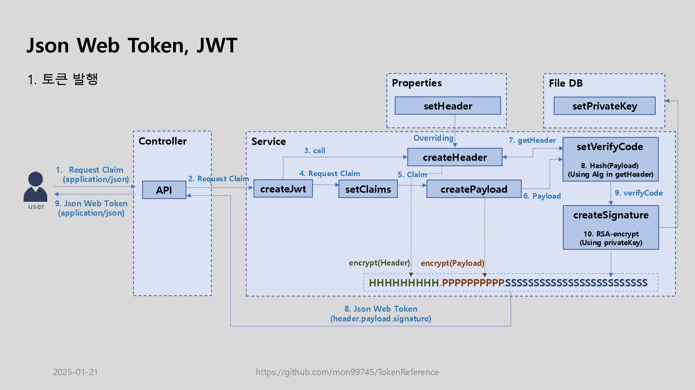
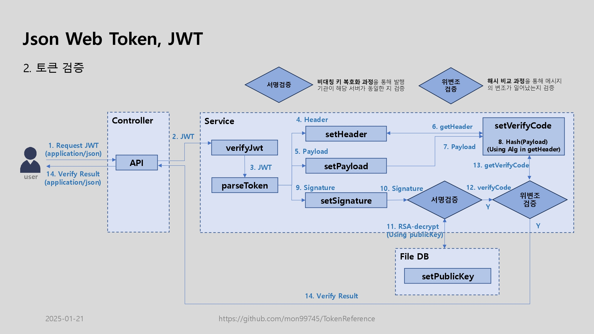
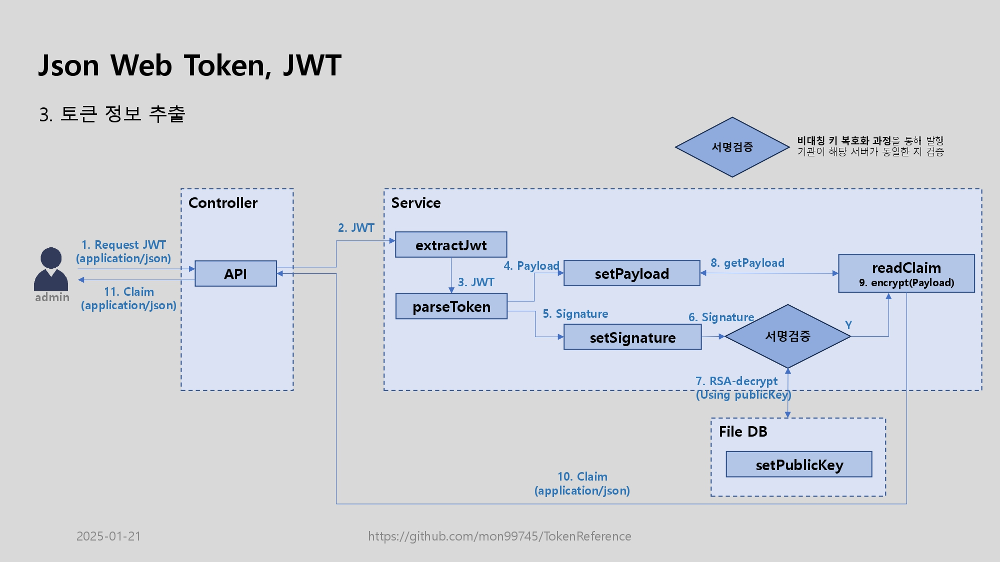

# Json Web Token, JwtsReference
이 프로젝트는 io.jsonwebtoken:jjwt-api 라이브러리를 대체하여 JwtProvider 역할을 수행하는 목적으로 작성된 결과물이며,
Json Web Token을 커스텀 발행 및 검증하여 관련 카테고리 개발의 시간 비용을 절감하고, 프로젝트의 소스와 설정 파일의 규격을 통일하여 코드의 품질과 가독성 향상하기 위한 목표로 증가 시키기 위한 목표로 추진한다.


The ultimate goal:
* Json Web Token 발급에 필요한 라이브러리 <u>`io.jsonwebtoken:jjwt-*` 를 대체 가능</u>하도록 한다.
* Json Web Token 발급과 검증에 최소한의 정보를 담아 커스텀 사용성을 확장하고, 이를 용이하도록 한다.

# Release
- [v1.1.0](./RELEASENOTE.md#v100-2024-04-24-) `-ing`
- [v1.0.0](./RELEASENOTE.md#v100-2024-01-30-)

# Process
  
  
  

# Guides
1. HTTP 통신 방식 (API 호출)
   1. API 호출 가이드
   2. API Method List
   3. API Response Format
   4. API 상세설명
      1. 토큰 발행
      2. 토큰 검증
      3. 토큰 정보 추출

[//]: # (1. JAR 라이브러리 호출 방식 )

[//]: # (   1. JAR 라이브러리 호출 가이드)

[//]: # (   2. Service Method List )

[//]: # (   3. Service Response Format )

[//]: # (   4. Service 상세설명)

[//]: # (      1. 토큰 발행)

[//]: # (      2. 토큰 검증)

[//]: # (      3. 토큰 정보 추출)


## HTTP 통신 방식 (API 호출)
### 1. API 호출 가이드
- 해당 프로젝트를 독립적으로 구성하여 HTTP 통신하여 해당 기능을 수행.

### 2. API Method List 

| Method Name | HTTP Method | Description |
|-------------|-------------|----------|
| api/v1/createToken        | POST        | 토큰 발행    |
| api/v1/verifyToken        | POST        | 토큰 검증    |
| api/v1/extractClaim        | POST        | 토큰 정보 추출 |


### 3. API Response Format
| Key        | Value | Description                      |
|------------|-------|----------------------------------|
| claim      | Map<String, String>  | 토큰 정보 포함되는 데이터<br/> (토큰 검증 시 제외) |
| jwt        | String  | 토큰                               |
| resultCode | String  | 결과 코드                            |
| resultMsg  | String  | 결과 메시지                           |
```json
{
   "claim": {
      "ci": "12345678",
      "role": "user",
      "username": "test_user",
      "password": "[VK+SJA26vJFCuDL/kPYAQ073GZTmTOpAbi5izZ10AFx3NlDDW6brVoBOeFlfA5hxHeOQw+Pz+M/XN.."
   },
   "jwt": "e29JzDyi.mwVQotk9DFqLwPpLw8TutiwiX6x4XQUrYtngFyoC7VPVs1txq54NGuzWbHt12rGbA6nnetYSnAinJRpVRzjyXj3GogWjwb2FMeYPshrZFhpaVvJFy2g39FcNusGHoHH5uBcmdEvme6g2crSuNKXbtsaREbakFtGu4oCk7CuVvz1XoAoc43Lc1hAbdU2VReEF7wxsKYQQLk.Ou+L/qyvpu8ssLpZ+qtDOYRQvHEcT/Qvq86KPapmXugS3SvZPnTnZdjzAB+Kcfd+bZX+OjXMBprUQHId25oD5OVK9XVq+3p839qpiJrbdYx6jWG7R5FhlQzQsH2CZezizUEkUlpc5Q38CNN3eJEZAOkO0TXhyMSyUkKyrMVDdVcLdJEzEXTVhwIICfG/+JCziI7/ijqBfSlGE4yB+14tfV2Ks2LdjfXf65zphz1Wm43oP2jzPFvreKta1twUKvhzKLAiYsxMD+kuL14zOJvYQJlnGozZG4rJT8qZUEVMglbCuoeqmXzmAUSGOcg6uaIN2/uPFT4oOgkmAkC5bvKw2g==",
   "resultCode": "200",
   "resultMsg": "Success"
}
```
### 4. API 상세설명
#### a. 토큰 발행
- 사용자의 정보를 통해 토큰을 발행한다.
- **메소드명 : api/v1/createToken**

| Request Type | Value  | Description |
|--------------|--------|-------------|
| POST         | JSONObject | JSONObject      |

#### 1-2) Request Parameters
* 토큰에 담기는 정보는 필요에 따라 달라진다(아래의 필드도 사용하지 않아도 무관)

| Key      | Value     | Description              |
|----------|-----------|--------------------------|
| ci       | String    | 구분 코드 값                  |
| role     | String    | 사용자 권한                   |
| username | String    | 사용자 아이디                  |
| password | String    | 사용자 패스워드<br/>(평문/암호문 무관) |
| ...      | Primitive Types | 사용자 정보                   |


```json
{
  "ci": "12345678",
  "role" : "user",
  "username" : "test_user",
  "password" : "[VK+SJA26vJFCuDL/kPYAQ073GZTmTOpAbi5izZ10AFx3NlDDW6brVoBOeFlfA5hxHeOQw+Pz+M/XN.."
}
```

#### b. 토큰 검증
- 사용자의 토큰을 검증한다.
- **메소드명 : api/v1/verifyToken**

| Request Type | Value  | Description |
|--------------|--------|-------------|
| POST         | JSONObject | JSONObject      |

#### 1-2) Request Parameters

| Key | Value     | Description |
|-----|-----------|-------------|
| jwt | String    | 토큰 값        |


```json
{
    "jwt": "e29JzDyi.mwVQotk9DFqLwPpLw8TutiwiX6x4XQUrYtngFyoC7VPVs1txq54NGuzWbHt12rGbA6nnetYSnAinJRpVRzjyXj3GogWjwb2FMeYPshrZFhpaVvJFy2g39FcNusGHoHH5uBcmdEvme6g2crSuNKXbtsaREbakFtGu4oCk7CuVvz1XoAoc43Lc1hAbdU2VReEF7wxsKYQQLk.Ou+L/qyvpu8ssLpZ+qtDOYRQvHEcT/Qvq86KPapmXugS3SvZPnTnZdjzAB+Kcfd+bZX+OjXMBprUQHId25oD5OVK9XVq+3p839qpiJrbdYx6jWG7R5FhlQzQsH2CZezizUEkUlpc5Q38CNN3eJEZAOkO0TXhyMSyUkKyrMVDdVcLdJEzEXTVhwIICfG/+JCziI7/ijqBfSlGE4yB+14tfV2Ks2LdjfXf65zphz1Wm43oP2jzPFvreKta1twUKvhzKLAiYsxMD+kuL14zOJvYQJlnGozZG4rJT8qZUEVMglbCuoeqmXzmAUSGOcg6uaIN2/uPFT4oOgkmAkC5bvKw2g=="
}
```

#### c. 토큰 정보 추출
- 사용자의 토큰을 통해 내부 정보를 추출한다.
- 해당 토큰은 만료 여부와 관계없이 서명 검증만 통과하면 내부 정보(클레임)을 추출할 수 있다.
- **메소드명 : api/v1/extractClaim**

| Request Type | Value  | Description |
|--------------|--------|-------------|
| POST         | JSONObject | JSONObject      |

#### 1-2) Request Parameters

| Key | Value     | Description |
|-----|-----------|-------------|
| jwt | String    | 토큰 값        |


```json
{
    "jwt": "e29JzDyi.mwVQotk9DFqLwPpLw8TutiwiX6x4XQUrYtngFyoC7VPVs1txq54NGuzWbHt12rGbA6nnetYSnAinJRpVRzjyXj3GogWjwb2FMeYPshrZFhpaVvJFy2g39FcNusGHoHH5uBcmdEvme6g2crSuNKXbtsaREbakFtGu4oCk7CuVvz1XoAoc43Lc1hAbdU2VReEF7wxsKYQQLk.Ou+L/qyvpu8ssLpZ+qtDOYRQvHEcT/Qvq86KPapmXugS3SvZPnTnZdjzAB+Kcfd+bZX+OjXMBprUQHId25oD5OVK9XVq+3p839qpiJrbdYx6jWG7R5FhlQzQsH2CZezizUEkUlpc5Q38CNN3eJEZAOkO0TXhyMSyUkKyrMVDdVcLdJEzEXTVhwIICfG/+JCziI7/ijqBfSlGE4yB+14tfV2Ks2LdjfXf65zphz1Wm43oP2jzPFvreKta1twUKvhzKLAiYsxMD+kuL14zOJvYQJlnGozZG4rJT8qZUEVMglbCuoeqmXzmAUSGOcg6uaIN2/uPFT4oOgkmAkC5bvKw2g=="
}
```

